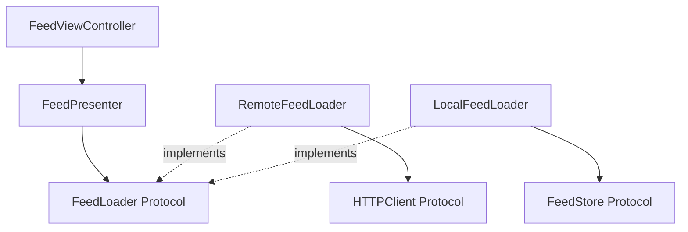

# Architecture & Design Principles Agent Skill

[](https://opensource.org/licenses/MIT)
[](https://agentskills.io)

Transform codebases into clean, testable, and maintainable architectures using SOLID principles, Clean Architecture, and proven design patterns from the Essential Developer methodology.

Based on the [Essential Developer](https://www.essentialdeveloper.com/) approach to software architecture as demonstrated in the [Essential Feed Case Study](https://github.com/essentialdevelopercom/essential-feed-case-study).

---

## Who This Is For

* **Software Architects** designing scalable systems
* **Senior Developers** refactoring legacy code
* **Tech Leads** establishing architectural standards
* **iOS/Swift Developers** applying Clean Architecture
* **Any Developer** seeking to write testable, maintainable code

---

## What This Skill Does

This skill guides AI agents through a structured 5-step process:

1. **Analyze Requirements** → Identify components, responsibilities, boundaries
2. **Apply SOLID Principles** → Design with SRP, OCP, LSP, ISP, DIP
3. **Define Clean Architecture** → Establish layers, boundaries, dependency rules
4. **Design Testing Strategy** → Plan unit tests, integration tests, test boundaries
5. **Document Decisions** → Create Architecture Decision Records (ADRs)

---

## Installation

### Option A: Using skills CLI (Recommended)

```bash
npx skills add SwiftyJourney/architecture-design-skill
```

This automatically installs the skill for your AI agent tools.

### Option B: Manual Installation

#### For Claude.ai

1. Download `architecture-design.skill` from [Releases](https://github.com/SwiftyJourney/architecture-design-skill/releases)
2. Upload to your Claude project

#### For Cursor

```bash
git clone https://github.com/SwiftyJourney/architecture-design-skill.git
cp -r architecture-design-skill/architecture-design ~/Library/Application\ Support/Cursor/User/globalStorage/skills/
```

#### For Windsurf

```bash
git clone https://github.com/SwiftyJourney/architecture-design-skill.git
# Follow Windsurf's skills installation guide
```

See the [Installation Guide](docs/INSTALLATION.md) for detailed instructions.

---

## Quick Start

Try this prompt:

```
I have this view controller that makes network requests, parses JSON, 
and updates the UI. How can I refactor it to follow Clean Architecture?
```

The agent will:

* Identify SOLID violations (SRP, DIP)
* Propose separation into layers (Domain, Infrastructure, Presentation)
* Define protocols for boundaries
* Create a testable architecture
* Provide implementation guidance

---

## Example Output

When you use this skill, you get:

**Component Analysis:**

```
Current Issues:
- View Controller violates SRP (networking + parsing + UI)
- Direct dependency on URLSession (violates DIP)
- Cannot test business logic without UI

Proposed Components:
1. Domain Layer: FeedItem entity, FeedLoader protocol
2. Infrastructure: RemoteFeedLoader, HTTPClient
3. Presentation: FeedPresenter
4. UI: FeedViewController (simplified)
```

**SOLID-Compliant Design:**

```swift
// Domain - Business Rules
protocol FeedLoader {
    func load(completion: @escaping (Result<[FeedItem], Error>) -> Void)
}

struct FeedItem: Equatable {
    let id: UUID
    let description: String?
    let location: String?
    let imageURL: URL
}

// Infrastructure - External Details
class RemoteFeedLoader: FeedLoader {
    private let client: HTTPClient
    
    init(client: HTTPClient) {
        self.client = client
    }
    
    func load(completion: @escaping (Result<[FeedItem], Error>) -> Void) {
        client.get(from: url) { result in
            // Handle response
        }
    }
}

// Presentation - View Logic
class FeedPresenter {
    private let loader: FeedLoader
    
    func didRequestFeed() {
        loader.load { result in
            // Update view
        }
    }
}
```

**Architecture Diagram:**



**Testing Strategy:**

```swift
class RemoteFeedLoaderTests: XCTestCase {
    func test_load_deliversItemsOnSuccessfulHTTPResponse() {
        let (sut, client) = makeSUT()
        
        expect(sut, toCompleteWith: .success([item1, item2]), when: {
            client.complete(with: [item1, item2])
        })
    }
    
    private func makeSUT() -> (sut: RemoteFeedLoader, client: HTTPClientSpy) {
        let client = HTTPClientSpy()
        let sut = RemoteFeedLoader(client: client)
        return (sut, client)
    }
}
```

---

## What's Included

```
architecture-design/
├── SKILL.md                         # Main skill (5-step process)
├── references/
│   ├── solid_principles.md          # SOLID with examples and anti-patterns
│   ├── clean_architecture.md        # Clean Architecture layers and rules
│   ├── testing_strategies.md        # TDD, mocking, test doubles
│   ├── dependency_management.md     # DI patterns and strategies
│   ├── modular_design.md           # Module organization
│   ├── design_patterns.md          # Adapter, Decorator, Composite, Null Object, etc.
│   ├── null_object_pattern.md      # Null Object Pattern in detail
│   └── command_query_separation.md # CQS principle for cache design
├── examples/
│   ├── swift/
│   │   ├── use_case_pattern.md     # Real Essential Feed examples
│   │   ├── composition_root.md     # Dependency wiring
│   │   ├── null_object_pattern.md  # Null Object in testing
│   │   └── command_query_separation.md # CQS in caching
│   └── generic/
│       └── layered_architecture.md # Language-agnostic examples
└── scripts/
    └── generate_architecture_doc.py # ADR generation automation
```

---

## Key Features

### SOLID Principles (with Examples)

* **Single Responsibility Principle** - One reason to change
* **Open/Closed Principle** - Open for extension, closed for modification
* **Liskov Substitution Principle** - Subtypes must be substitutable
* **Interface Segregation Principle** - Focused interfaces
* **Dependency Inversion Principle** - Depend on abstractions

### Clean Architecture Layers

* **Domain Layer** - Entities and use cases (business rules)
* **Infrastructure Layer** - Network, database, frameworks
* **Presentation Layer** - Presenters and view models
* **UI Layer** - View controllers and views

### Design Patterns

* Adapter, Decorator, Composite
* Strategy, Factory, Observer
* Main-Thread Decorator
* Fallback Composite

### Testing Strategies

* Unit tests (70%) - Fast, isolated
* Integration tests (20%) - Real dependencies
* UI tests (10%) - Full flow
* Test doubles (Stubs, Spies, Mocks, Fakes)

---

## Usage Examples

### Example 1: Refactoring God Class

**Input:** "This UserManager class handles authentication, profile updates, and analytics. How do I refactor it?"

**Output:**
* Identified SRP violations
* Proposed separation: AuthService, ProfileService, Analytics
* Created protocols for each responsibility
* Testing strategy for isolated components

### Example 2: Adding Feature to Existing Codebase

**Input:** "I need to add offline caching to my feed loader. How do I do this without breaking existing code?"

**Output:**
* Applied Open/Closed Principle
* Created FeedCache protocol
* Implemented FeedLoaderCacheDecorator
* Maintained existing tests

### Example 3: Making Code Testable

**Input:** "My view controller directly uses URLSession. How do I make it testable?"

**Output:**
* Identified DIP violation
* Created HTTPClient protocol
* Injected dependency through initializer
* Provided test double examples

---

## Supported Agent Tools

This skill works with any tool supporting the [Agent Skills open format](https://agentskills.io):

* ✅ Claude.ai & Claude Code
* ✅ Cursor
* ✅ Windsurf
* ✅ Cline
* ✅ GitHub Copilot
* ✅ And many more

---

## Based On

This skill implements the Essential Developer's proven architecture methodology:

* [Essential Feed Case Study](https://github.com/essentialdevelopercom/essential-feed-case-study)
* [iOS Lead Essentials Program](https://iosacademy.essentialdeveloper.com/)
* [Essential Developer Blog](https://www.essentialdeveloper.com/articles)
* Industry-standard Clean Architecture and SOLID practices

---

## Philosophy

> "Good architecture is a byproduct of good team processes and effective communication"

This skill helps you:

* **Write testable code** - Easy to test means good design
* **Maximize flexibility** - Change is the only constant
* **Minimize coupling** - Independent, composable components
* **Follow proven patterns** - Learn from battle-tested approaches

---

## Documentation

* 📖 [Quick Start Guide](docs/QUICKSTART.md) - Get started in 5 minutes
* 🔧 [Installation Guide](docs/INSTALLATION.md) - Detailed install for all tools
* 🏗️ [Architecture Guide](docs/ARCHITECTURE.md) - Deep dive into Clean Architecture
* 🧪 [Testing Guide](docs/TESTING.md) - Comprehensive testing strategies
* 🤝 [Contributing](docs/CONTRIBUTING.md) - How to contribute

---

## Contributing

Contributions are welcome! Whether you want to:

* Add new architecture patterns
* Improve SOLID examples
* Enhance testing strategies
* Fix documentation
* Add more real-world examples

See [CONTRIBUTING.md](docs/CONTRIBUTING.md) for guidelines.

---

## License

This skill is open-source and available under the MIT License. See [LICENSE](LICENSE) for details.

---

## Author

Created by Juan Francisco Dorado Torres at SwiftyJourney, inspired by the Essential Developer's architecture methodology.

---

## Acknowledgments

* [Essential Developer](https://www.essentialdeveloper.com/) for the architecture methodology and principles
* [Caio Zullo](https://github.com/caiozullo) and [Mike Apostolakis](https://github.com/mapostolakis) for the Essential Feed Case Study
* [Anthropic](https://www.anthropic.com/) for the Agent Skills format
* [Agent Skills community](https://agentskills.io) for the open standard

---

**Ready to transform your architecture?** Install the skill and start building clean, testable code! ✨

---

## Related Skills

* [Requirements Engineering Skill](https://github.com/SwiftyJourney/requirements-engineering-skill) - Transform requirements into BDD stories and use cases
* More skills coming soon...
